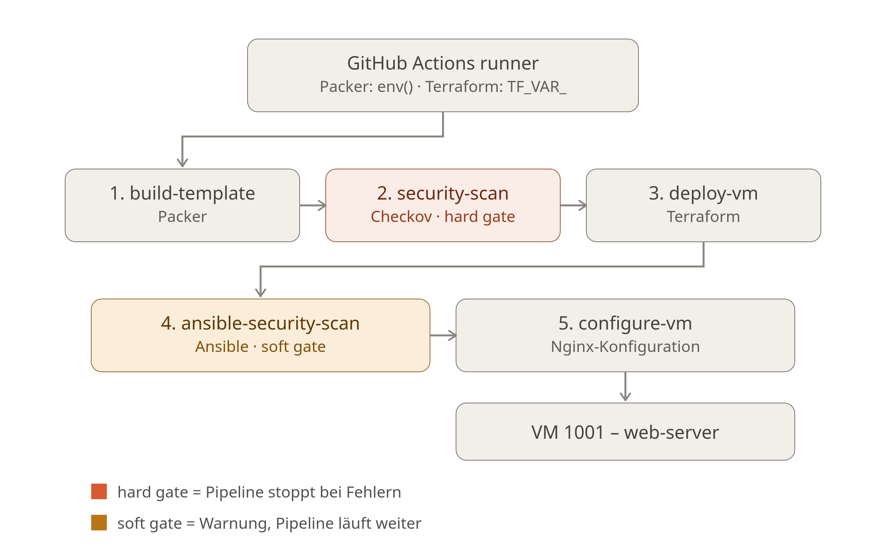

# 🚀 CI/CD Pipeline Setup für Proxmox mit Security-Gate

> Automatisierte Infrastructure-as-Code Pipeline mit Packer, Terraform, Ansible, GitHub Actions und Checkov Custom Policy Checks


---

## 📋 Inhaltsverzeichnis

- [Projektübersicht](#-projektübersicht)
- [Technologie-Stack](#-technologie-stack)
- [Projektstruktur](#-projektstruktur)
- [Architektur-Vertiefungen](#-architektur-vertiefungen)
- [Voraussetzungen](#️-voraussetzungen)
- [Installation & Setup](#-installation--setup)
- [Nutzung](#️-nutzung)
- [Konfiguration](#-konfiguration)
- [Fehlerbehebung](#-fehlerbehebung)
- [Bekannte technische Schuld](#️-bekannte-technische-schuld-offen)
- [Roadmap - Was als nächstes kommt](#️-roadmap-was-als-nächstes-kommt)
- [Zukunftsausblick](#-zukunftsausblick-ai-driven-siem--monitoring)

---

## 🎯 Projektübersicht



Dieses Projekt automatisiert die sichere Bereitstellung einer vollständigen Infrastruktur auf Proxmox VE mittels Infrastructure-as-Code (IaC). Ein hartes Security-Gate (Terraform-Seite) sowie ein ergänzendes Soft-Gate (Ansible-Seite) verhindern bzw. dokumentieren fehlerhafte Deployments.

| Komponente | Aufgabe |
|------------|---------|
| **Packer** | Erstellt ein Ubuntu 22.04 Golden-Image-Template (Cloud-Image-basiert, `proxmox-clone`-Builder) |
| **Terraform** | Provisioniert zwei VMs auf Proxmox mittels `bpg/proxmox` Provider: Web-Server und DB-Server |
| **Checkov** | Validiert IaC auf Security-Policies **vor** dem Deploy (Terraform: hartes Gate, Ansible: Soft-Gate) |
| **Ansible** | Konfiguriert die VMs: Nginx auf dem Web-Server, PostgreSQL auf dem DB-Server (inkl. Netzwerkzugriffskonfiguration zwischen beiden) |
| **GitHub Actions** | Automatisiert die komplette Pipeline inkl. beider Security-Gates (self-hosted Runner) |

**Hinweis zur Phasen-Nummerierung:** Die Security-Erweiterung des Projekts läuft in benannten, aufeinander aufbauenden Phasen (2A, 2B, 2C, ...) – jede Referenz auf "Phase X" bezieht sich auf diese interne Roadmap, nicht auf einen externen Standard.

- **Phase 2A** – Statisches Security-Gate (Checkov) in die Pipeline integriert *(abgeschlossen)*
- **Phase 2B** – CIS-Härtung des Packer-Golden-Images *(abgeschlossen)*
- **Phase 2C** – Zweite VM (DB-Server, PostgreSQL) aus dem gehärteten Image, inkl. Netzwerkzugriffskonfiguration Web-Server → DB-Server *(abgeschlossen)*

Die Reise geht danach weiter – Phasen 3 bis 6 (State-Backend, Dynamisches
Inventar, Vault, Compliance-Doku) findest du unter
[🗺️ Roadmap: Was als Nächstes kommt](#️-roadmap-was-als-nächstes-kommt).

[↑ Nach oben](#-inhaltsverzeichnis)

---

## 🛠 Technologie-Stack

| Tool | Version | Zweck |
|------|---------|-------|
| Packer | 1.9+ (Proxmox-Plugin gepinnt auf `1.1.8`) | Template-Erstellung |
| Terraform | 1.5+ | Infrastructure Provisioning |
| Checkov | 3.3.6 | Policy-as-Code Security-Scanning (Terraform- und Ansible-Framework) |
| Ansible | 2.14+ | Configuration Management |
| PostgreSQL | 14 (Ubuntu-22.04-Standardversion) | Datenbank auf dem DB-Server |
| Proxmox VE | 7.x/8.x | Virtualisierungsplattform |
| Ubuntu | 22.04 LTS | Betriebssystem (Cloud-Image) |

[↑ Nach oben](#-inhaltsverzeichnis)

---

## 📁 Projektstruktur

### Hauptverzeichnis
- **`.github/workflows/pipeline.yml`** - GitHub Actions Pipeline mit beiden Security-Gates
- **`README.md`** - Diese Projektübersicht
- **`docs/`** - Vertiefende Architektur-Dokumentation (siehe unten)

### Packer
- **`packer/ubuntu-2204.pkr.hcl`** - Packer Template (`proxmox-clone`-Builder)
- **`packer/setup-base-image.sh`** - Reproduzierbarer Aufbau der Cloud-Image-Basis-VM
- **`packer/_archiv-iso-ansatz/`** - Archivierter, verworfener ISO/Subiquity-Ansatz (Dokumentationszweck)

### Terraform
- **`terraform/main.tf`** - VM-Definitionen: `web_server` und `db_server`
- **`terraform/provider.tf`** - Provider & API-Konfiguration
- **`terraform/variables.tf`** - Variablendeklaration (getrennte Abschnitte je VM)
- **`terraform/outputs.tf`** - Ausgaben für Ansible (`vm_ip`, `db_server_ip`, u. a.)
- **`terraform/checks/`** - Custom Checkov Security Checks (`CKV_PROXMOX_1/2/3`)
- **`terraform/terraform.tfvars.example`** - Variablen-Vorlage

### Ansible
- **`ansible/inventory.ini`** - Wird pro Pipeline-Lauf dynamisch aus beiden Terraform-Output-IPs erzeugt
- **`ansible/playbook.yml`** - Zwei eigenständige Plays: Web-Server (Nginx) und DB-Server (PostgreSQL)
- **`ansible/checks/task/`** - Custom Checkov Security Check für Ansible-Tasks (`CKV_ANSIBLE_CUSTOM_1`)

[↑ Nach oben](#-inhaltsverzeichnis)

---

## 📚 Architektur-Vertiefungen

Diese README hält sich bewusst kurz. Wer tiefer in einzelne Entscheidungen einsteigen will, findet die ausführlichen Erklärungen hier:

| Thema | Kurzbeschreibung | Vertiefung |
|---|---|---|
| **Security-Gates** | Zwei Checkov-Gates (hart/weich), Custom Checks, `checkov:skip`-Prinzip | [`docs/security-gates.md`](docs/security-gates.md) |
| **CIS-Härtung (Phase 2B)** | Golden-Image-Härtung: SSH, Firewall, Updates, Dienste | [`docs/cis-hardening.md`](docs/cis-hardening.md) |
| **DB-Server (Phase 2C)** | Drei-Ebenen-Netzwerkmodell (Firewall/Lauschen/Zugriffsregel) | [`docs/db-server-architecture.md`](docs/db-server-architecture.md) |
| **Authentifizierung** | Dual-Auth Proxmox-API + getrennte SSH-Key-Architektur (Build/Produktiv) | [`docs/authentication.md`](docs/authentication.md) |

[↑ Nach oben](#-inhaltsverzeichnis)

---

## ⚙️ Voraussetzungen

- Proxmox VE Host, erreichbar über die API (`https://<proxmox-ip>:8006/api2/json`)
- Self-hosted GitHub Actions Runner, registriert mit den Labels `self-hosted` **und** `proxmox` (ohne exaktes Label-Match hängt der Job endlos in der Warteschlange, ohne Fehlermeldung)
- Auf dem Runner installiert: Packer, Terraform, Ansible, Checkov (>= 3.3.6)
- GitHub Secrets gesetzt:
  - `PROXMOX_URL`, `PROXMOX_USER`, `PROXMOX_PASSWORD` (für Packer)
  - `TF_VAR_*`-Secrets passend zu den in `variables.tf` deklarierten Variablen
  - `SSH_PRIVATE_KEY` (dauerhafter Produktiv-Key, User `ansible` – siehe [`docs/authentication.md`](docs/authentication.md))
  - `SSH_PUBLIC_KEY` (öffentlicher Gegenpart, als `TF_VAR_ssh_public_key` an Terraform übergeben)
- Eine bereits existierende Cloud-Image-Basis-VM (Template, standardmäßig VM-ID `9000`) als Klon-Quelle für Packer

## 🔧 Installation & Setup

1. Repository auf den self-hosted Runner klonen
2. Basis-Image einmalig aufbauen:
   ```bash
   chmod +x packer/setup-base-image.sh
   ./packer/setup-base-image.sh
   ```
   Erstellt die Cloud-Image-Basis-VM (Standard: ID `9000`), inkl. Disk-Vergrößerung und Guest-Agent-Flag.
3. `terraform/terraform.tfvars` aus `terraform/terraform.tfvars.example` erstellen und mit den eigenen Werten befüllen (Netzwerk, IPs für Web- und DB-Server, Disk-Größe, `template_vm_id`)
4. GitHub Secrets im Repo hinterlegen (siehe Voraussetzungen)
5. Self-hosted Runner registrieren und mit dem Label `proxmox` versehen
6. Push auf `main` (oder Pull Request) startet die Pipeline automatisch

## ▶️ Nutzung

Ein Push auf `main` löst die Pipeline mit fünf aufeinander aufbauenden Jobs aus:

```
build-template          → Packer baut/erneuert das Golden-Image-Template
security-scan           → Checkov-Gate, Terraform (hart) – Stop bei Verstoß
deploy-vm               → Terraform provisioniert Web-Server UND DB-Server
ansible-security-scan   → Checkov-Gate, Ansible (weich) – Report, kein Stop
configure-vm            → Ansible konfiguriert Nginx und PostgreSQL
```

Der Fortschritt ist im GitHub-Actions-Tab des Repos einsehbar. Schlägt `security-scan` fehl, werden die folgenden drei Jobs gar nicht erst gestartet ("Skipped", 0 Sekunden Laufzeit). Schlägt dagegen `ansible-security-scan` fehl, läuft `configure-vm` trotzdem an (Soft-Gate).

Nach einem erfolgreichen Lauf sind beide VMs über ihre von Terraform ausgegebenen IPs erreichbar (`terraform output -raw vm_ip` bzw. `terraform output -raw db_server_ip`).

## 🔩 Konfiguration

Wichtige Stellschrauben in `terraform/variables.tf` / `terraform.tfvars`:
- `template_vm_id` – ID des Packer-Golden-Image-Templates, das geklont wird
- `web_server_ip`, `db_server_ip`, `network_gateway` – Netzwerkkonfiguration der VMs
- `web_server_disk_size`, `db_server_disk_size` – Ziel-Diskgröße (muss `>= 40` sein, sonst blockiert `CKV_PROXMOX_3`)
- `db_server_cores`, `db_server_memory` – Ressourcengröße des DB-Servers

Mindestwerte der Custom Checks sind direkt im jeweiligen Check-Code als Konstanten hinterlegt (z. B. `MIN_DISK_SIZE_GB` in `ProxmoxDiskMemorySet.py`) und bei Bedarf dort anpassbar.

[↑ Nach oben](#-inhaltsverzeichnis)

---

## 🩹 Fehlerbehebung

| Symptom | Ursache | Lösung |
|---|---|---|
| Job hängt endlos in "Queued" | Runner-Label passt nicht zu `runs-on` in `pipeline.yml` | Label `proxmox` beim Runner ergänzen |
| `E: Could not get lock /var/lib/apt/lists/lock` im Packer-Build | Cloud-Init läuft beim ersten Boot noch, blockiert `apt`-Lock | `sudo cloud-init status --wait` als erste Zeile im `shell`-Provisioner |
| `config file already exists` beim Packer-Build | Template-VM-ID existiert in Proxmox bereits | Cleanup-Step (`qm destroy <id> \|\| true`) vor dem Build, bereits in `pipeline.yml` integriert |
| `config file already exists` beim Terraform-`apply`, obwohl Plan `X to add` zeigt | State-Drift: lokal getesteter State kennt eine VM, die im Runner-eigenen State nicht existiert | Betroffene VM einmalig löschen (`qm destroy <id>`), Pipeline im Runner-Kontext neu bauen lassen. Strukturelle Lösung: zentrales State-Backend (Phase 3) |
| Terraform will VM erneut anlegen, obwohl sie läuft | `terraform.tfstate` ging beim Checkout verloren (self-hosted Runner mit geteiltem Arbeitsordner) | `clean: false` bei **allen** `actions/checkout`-Schritten setzen |
| Dienst von einer anderen VM aus nicht erreichbar (`Connection refused`), obwohl Firewall-Regel korrekt ist | Dienst lauscht per Default nur auf `localhost` | Netzwerk-Lauschen (z. B. `listen_addresses` bei PostgreSQL) anpassen, siehe [`docs/db-server-architecture.md`](docs/db-server-architecture.md) |
| `REMOTE HOST IDENTIFICATION HAS CHANGED` bei SSH | VM wurde unter gleicher IP neu aufgebaut, neuer Host-Key | `ssh-keygen -f ~/.ssh/known_hosts -R '<ip>'` |
| Checkov zeigt scheinbar wechselnde Ergebnisse ohne Codeänderung | `--check <ID>`-Flag filtert die Anzeige auf einen Check | Ohne `--check`-Filter testen |
| Checkov lädt Custom-Check gar nicht | Fehlende/falsch benannte `__init__.py`, oder falscher `--external-checks-dir`-Pfad | Ordnerstruktur prüfen; direkter `importlib`-Test macht den Fehler sichtbar |

[↑ Nach oben](#-inhaltsverzeichnis)

---

## ⚠️ Bekannte technische Schuld (offen)

Transparent dokumentiert statt verschwiegen, analog zum `checkov:skip`-Prinzip:

**Ports 80/443 im Golden Image gelten für jede geklonte VM, unabhängig von der Rolle.** Der Packer-Provisioner öffnet UFW-Ports 22/80/443 einmalig im Template (Phase 2B). Für den DB-Server sind das zwei unnötig offene Ports (Verstoß gegen minimale Angriffsfläche) – noch keine Entscheidung getroffen, ob die Ports generell aus dem Template entfernt werden oder rollenspezifische VMs sie aktiv wieder schließen. Details: [`docs/cis-hardening.md`](docs/cis-hardening.md).

[↑ Nach oben](#-inhaltsverzeichnis)

---

## 🗺️ Roadmap: Was als Nächstes kommt

Nach Abschluss der Phasen 2A–2C folgen weitere, aufeinander aufbauende Ausbaustufen Richtung Enterprise-Reife:

| Phase | Thema | Kernidee |
|---|---|---|
| **3** | State-Backend | Zentrales, gesperrtes Terraform-State-Backend statt lokaler `.tfstate`-Datei – verhindert State-Drift zwischen verschiedenen Ausführungsorten |
| **4** | Dynamisches Inventar | Ansible fragt Proxmox live nach existierenden VMs ab, statt IPs manuell in `inventory.ini` zu pflegen |
| **5** | Secrets-Management (Vault) | Ablösung von Klartext-Secrets durch HashiCorp Vault, inkl. VM-spezifischer Zugangsdaten |
| **6** | Compliance & Doku-Automatisierung | `terraform-docs`/`ansible-doc` generieren Teile dieser Dokumentation künftig automatisch |

Die vollständige Begründung der Phasenreihenfolge (warum diese Reihenfolge und nicht anders) steht in `00_projekt_ziel_und_lernpfad.md`.

[↑ Nach oben](#-inhaltsverzeichnis)

---

## 🚀 Zukunftsausblick: AI-Driven SIEM & Monitoring

Nach dem erfolgreichen Abschluss der IaC-Phasen wird das Framework um eine automatisierte Sicherheitsüberwachung (SOC-in-a-Box) erweitert:

- **Automated Deployment:** Ansible-gestützte Instanziierung von Netzwerk-Sensoren (**Zeek / Snort**) sowie ein zentraler Log-Cluster (**Grafana / OpenSearch**)
- **Data Pipeline:** Automatisierter Versand von System- und Netzwerktracks (via Promtail/Beats) an das zentrale SIEM
- **AI-Driven Analytics:** Eigenständige Python-Pipeline (**Pandas**) zur Anomalie-Erkennung in Log-Strukturen
- **Automated Reporting:** LLM-gestützte Kontext-Evaluierung von Sicherheitsvorfällen, Generierung von *Executive Security Compliance Reports*

[↑ Nach oben](#-inhaltsverzeichnis)
